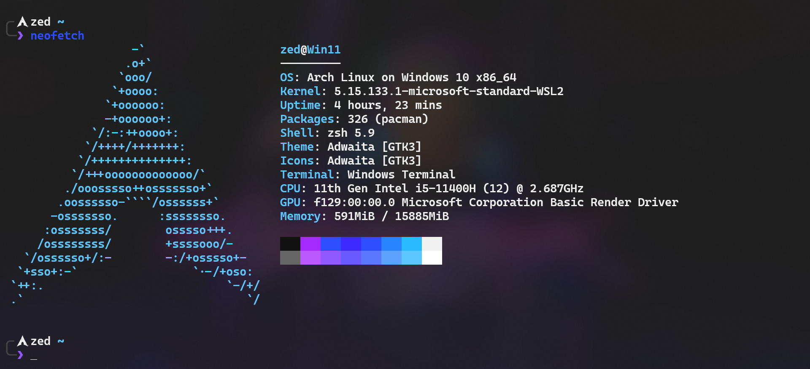

<h1 align="center">Hi there, I'm Lucas S. França 👋</h1>

Enthusiastic software engineer with a mindset of designing and developing innovative software solutions. Thrive on solving complex problems and transforming ideas into elegant, efficient, and scalable code. Dedication to staying at the forefront of technology and commitment to continuous learning enable me to adapt to rapidly evolving tech landscapes. I'm excited to collaborate with teams that value innovation, creativity, and a relentless pursuit of excellence.

Skills:
💻 Programming Languages: JavaScript, TypeScript, Golang.
🌐 Web Development: HTML, CSS, React, Node.js.
🔧 Tools & Technologies: Git, Docker, AWS.

📊 Data: SQL, NoSQL, Data Analysis.
🚀 DevOps: CI/CD, K8s.
🔒 Security: Security Best Practices, Encryption.

🛠️ Problem Solving: Critical Thinking, Algorithm Design, Data-Driven.

<h2 align="center">🛠 Technologies & Skils</h2>

    
    
    
    
    
    
    
    
    
    
    
    
    

 

<h2 align="center">💻 Open Source Projects</h2>

  I always make sure that I find enough time for open source contribution that also helps me expand my knowledge and work with other developers and team globally. here are some of my projects:

- soon...

